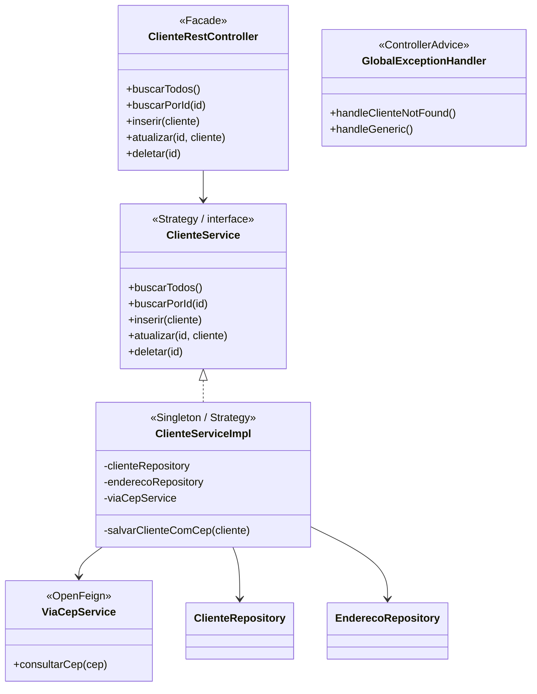

# Padrões de Projeto — Spring Boot

Módulo do desafio **Padrões de Projeto com Java e Spring** — Bootcamp Santander 2026.

---

## Descrição

API REST que aplica os padrões **Singleton**, **Strategy** e **Facade** no contexto do Spring Boot 3, com integração à API ViaCEP, persistência em H2 e documentação via Swagger.

---

## Padrões no Contexto do Spring

| Padrão | Como aparece |
|---|---|
| **Singleton** | Todo `@Service` e `@Repository` é gerenciado como Singleton pelo container Spring |
| **Strategy** | `ClienteService` é a interface — `ClienteServiceImpl` é a implementação injetada via `@Autowired` |
| **Facade** | `ClienteRestController` abstrai a complexidade de JPA + ViaCEP em endpoints simples |

---

## Diagrama UML



---

## Estrutura do Projeto

```
lab-padroes-projeto-spring/
├── pom.xml
└── src/main/
    ├── java/br/com/padroes/
    │   ├── Application.java
    │   ├── controller/
    │   │   └── ClienteRestController.java
    │   ├── exception/
    │   │   ├── ClienteNotFoundException.java
    │   │   └── GlobalExceptionHandler.java
    │   ├── model/
    │   │   ├── Cliente.java
    │   │   └── Endereco.java
    │   ├── repository/
    │   │   ├── ClienteRepository.java
    │   │   └── EnderecoRepository.java
    │   └── service/
    │       ├── ClienteService.java
    │       ├── ViaCepService.java
    │       └── impl/
    │           └── ClienteServiceImpl.java
    └── resources/
        └── application.properties
```

---

## Evoluções em relação ao projeto de referência

| Melhoria | Detalhe |
|---|---|
| Spring Boot 3.2.5 + Java 21 | Atualizado de Spring Boot 2.5.4 / Java 11 |
| `jakarta.persistence` | Migrado de `javax.persistence` (obrigatório no Spring Boot 3+) |
| `orElseThrow()` | Substituiu `Optional.get()` sem verificação |
| Pacote `repository` separado | Repositórios fora do pacote `model` |
| `GlobalExceptionHandler` | `@RestControllerAdvice` com tratamento centralizado de erros |
| `ClienteNotFoundException` | Exceção customizada de negócio (Unchecked) |
| `ResponseEntity.noContent()` | `DELETE` retorna 204 em vez de 200 vazio |

---

## Como Executar

**Pré-requisito:** JDK 21 e Maven instalados.

```bash
cd lab-padroes-projeto-spring
mvn spring-boot:run
```

| Recurso | URL |
|---|---|
| API REST | `http://localhost:8080/clientes` |
| Swagger UI | `http://localhost:8080/swagger-ui.html` |
| H2 Console | `http://localhost:8080/h2-console` |

---

## Endpoints

| Método | Endpoint | Descrição |
|---|---|---|
| `GET` | `/clientes` | Lista todos os clientes |
| `GET` | `/clientes/{id}` | Busca cliente por ID |
| `POST` | `/clientes` | Insere novo cliente |
| `PUT` | `/clientes/{id}` | Atualiza cliente existente |
| `DELETE` | `/clientes/{id}` | Remove cliente |

### Exemplo de requisição POST

```json
{
  "nome": "Venilton",
  "endereco": {
    "cep": "01310-100"
  }
}
```

O sistema consulta automaticamente o ViaCEP e persiste o endereço completo.

---

## Tecnologias

- Java 21
- Spring Boot 3.2.5
- Spring Data JPA
- Spring Web
- OpenFeign
- H2 Database
- Springdoc OpenAPI 2.x (Swagger)
- Maven

---

